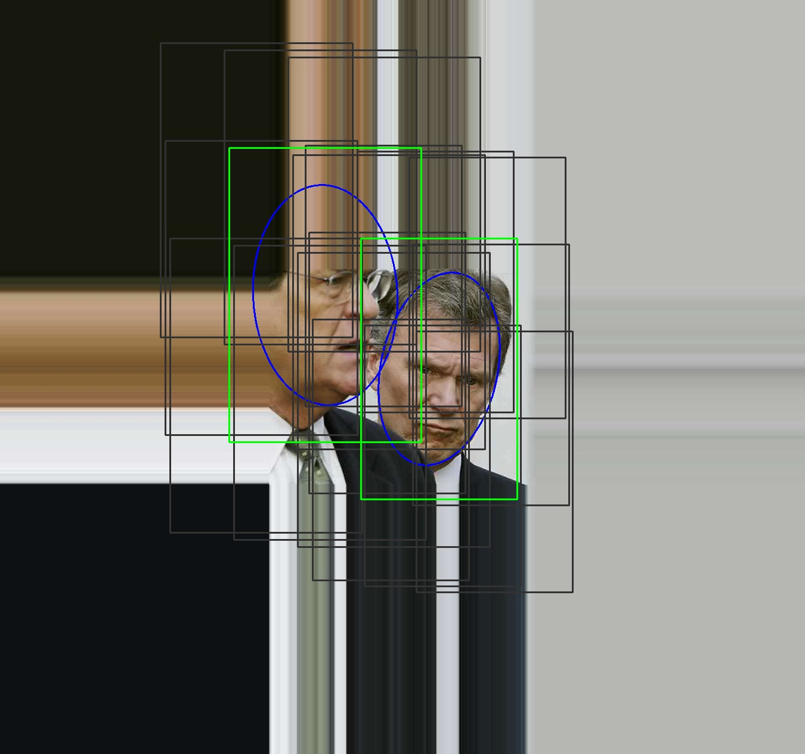
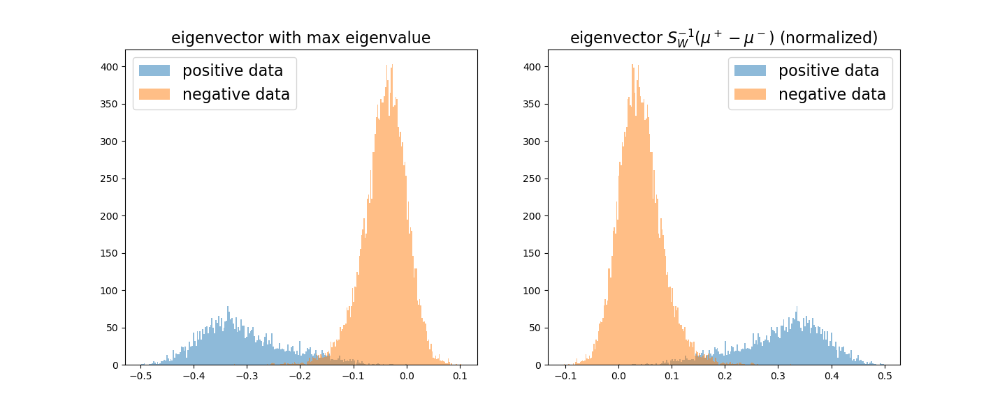

## Data preprocessing

### 原始数据和样本边框

原始数据集的处理结果示例如下：



绿色框为正样本，黑色框为负样本，蓝色为原始数据椭圆

**分析**

因为很多人脸只显示了一小部分，所以我设置了比较大padding值，

另外这里错开的边框错开显示，是为了显示效果调整的，实际边框很多部分是重合的。

人脸椭圆往往是有一定角度的，不过基于人脸基本是正的，以及为了计算的简便性，我直接以椭圆的短轴和长轴作为了基准，严格来说，应该使用椭圆上下左右的切线作为边框

### HOG特征图

下图可以明显的看出hog特征效果十分良好

<div><center></br><p>随机从处理结果中抽取两个样本,可以看到HOG特征图和原始图像匹配良好</p></center></div>

## Model learning

### logistic model

模型使用{-1, +1}分类模型，数据集为提取出的hog特征

#### Loss

learning model is to minimize loss function
$$
\begin{aligned}
\sum_{i=1}^n L(&y_i,X_i^T\beta)=\sum_{i=1}^n log[1+exp(-y_iX_i\beta)]\\&where 
\left\{ \begin{aligned}
y_i&:1\times1 \text{ , i-th label with value\{-1,+1\}} \\
X_i&:p\times1 \text{ , i-th data with p features}\\
\beta&:p\times1 \text{ , parameter with p numbers}\\
i&:index \text{, from 1 to n, there n samples}\\
\end{aligned}
\right.
\end{aligned}
$$
actually, $p=900$

#### Gradient

the gradient of loss function is as below:
$$
\begin{align}
\sum_{i=1}^n \frac{\part L(y_i,X_i^T\beta)}{\part \beta}
&=\sum_{i=1}^n \frac{exp(-y_iX_i\beta)}{1+exp(-y_iX_i\beta)}(-y_iX_i)\\
&=\sum_{i=1}^n \frac{1}{1+exp(y_iX_i\beta)}(-y_iX_i)
\end{align}
$$

#### Matrices Forms for  Loss and Gradient

let 
$$
\begin{align}
&X=[X_1^T;X_2^T;...,X_n^T]&n\times p\\
&Y=[y_1,y_2,...,y_n]&n\times 1\\
&\beta &p\times 1 \\
&L = \sum_i^nL(y_i,X_i^T\beta)&1 \times 1 \\
\end{align}
$$
and define a new operation for coding
$$
sum(M) = \sum_i^n m_i\text{ , where }M = [m_1,m_2,...,m_n]
$$
so there is a matrix form for upper equation, **all basic operations are element-wise  except operations only for matrices** :
$$
L=sum(log[1+exp(-Y\circ(X\beta))]) \\
\frac{\part L}{\part \beta}=(\frac{1}{1+exp(Y\circ(X\beta))})^T(Y\circ X)
$$
the **code** are as below

```python
# X shape: n*p
# Y shape: n*1 with{-1,+1}
p = np.multiply(Y, np.matmul(X, self.w)[:, np.newaxis])

# forward loss
loss = np.sum(np.log(1+np.exp(-1*p)))

#gradient
gradient = np.matmul(np.divide(1, 1 + np.exp(p)).T, -np.multiply(Y, X))
```

#### Optimizer

##### SGD

batch then learn

```python
## SGD
self.w = self.w - self.lr*gradient
```

##### SGLD

```python
## Langevin  SGLD
epsilon = np.random.normal(loc=0.0, 
                           scale=np.sqrt(self.lr), 
                           size=self.n_feature)

self.w = self.w - 0.5*self.lr*gradient + np.sqrt(self.lr)*epsilon
```

#### Result

The Optimizer is SGD 

In the **first epoch**, we can see the loss and accuracy increased a lot.


the whole process of training reslut is


After 50 epoch training, I finally reach the loss $0.06950$ and accuracy $0.97500$ in training set (20680 faces in total),

Using this model, I get $119$ wrong prediction with  correct rate $0.97713$ in test set (5203 faces in total).

the model parameters are shown in below:


If use SGLD as Optimizer, the result is also very good, result for test is **correct rate: 0.97386 , test size: 5203, error size: 136.0**


### Fisher Model (LDA)

#### target function

$$
\underset{\beta}{max}\beta^TS_B\beta\text{ ,  s.t.  }\beta^TS_W\beta=1 
$$
Using lagrange multipliers for this maximization problem:
$$
L =\beta^TS_B\beta - \lambda(\beta^TS_W\beta-1)\\
\text{with condition}
\left\{
\begin{aligned}
\frac{\part L}{\part \beta} &=2 S_B\beta-2\lambda S_W\beta = 0\\
\frac{\part L}{\part \lambda}&=0
\end{aligned}
\right.
$$
from condition (1), we can get two information:
$$
S_W^{-1} S_B \beta = \lambda \beta \\
$$
and 
$$
S_B \beta = \lambda S_W \beta
$$
#### 最优解以及特征向量和特征值的分析和讨论

>1)要求解的特征向量只有一个，即与 $S_W^{-1}(\mu^+ - \mu^-)$ 共线的向量。
>
>2)$||\lambda||$代表了目标函数，$||\lambda||$越大，分类效果越好；$||\lambda||$越小，代表数据混合越均匀。

**下面主要为这两个结论的分析与验证**

From eqution (10) ,we can get $\beta$ is a eigenvector of matrix $S_W^{-1} S_B \beta$ . Furthermore, we can find that $\beta \propto S_W^{-1}(\mu^+ - \mu^-)$ by:
$$
\begin{aligned}
S_B\beta &= (\mu^+ - \mu^-)(\mu^+ - \mu^-)^T \beta \\
&= (\mu^+ - \mu^-)((\mu^+ - \mu^-)^T \beta)\\
&= (\mu^+ - \mu^-)\alpha\\
S_W^{-1}S_B \beta &= \alpha S_W^{-1}(\mu^+ - \mu^-)\\
&= \lambda \beta \text{ ,   which means }\beta \text{ must be collinear with }S_W^{-1}(\mu^+ - \mu^-)
\end{aligned}
$$

从上面我们可以得出我们要求解的特征向量只有一个，即与 $S_W^{-1}(\mu^+ - \mu^-)$ 共线的向量.

From eqution (11),等式两侧同乘以$\beta^T$,可以得到 $\lambda = \frac{\beta^TS_B\beta}{\beta^TS_W \beta}$ ,所以**$||\lambda||$代表了目标函数**，**$||\lambda||$越大，分类效果越好**。我们同样可以用这个标准来选择特征值和特征向量.

计算出的特征值如下:


我们可以看到只有一个特征值数量级为 $10^{-3}$(位于左上角), 其他特征值的数量级全部小于$10^{-15}$(大多为复数). 下图是所有特征值在复平面上的分布


根据之前的结论$||\lambda||$代表了分类效果，我们可以得出**只有一个特征值(数量级为$10^{-3}$)相对应的特征向量有分类效果**。其他的特征向量的效果恰恰相反，它们**最小化了目标函数**，使特征分布的类间方差相对于类内方差几乎为0，这意味着**其他的特征向量使两类数据均匀的混合到了一起**，数据分布没有了差异性。

使用复数特征向量变换有些复杂，我选取了全部的实数进行数据降维处理，数据确实均匀的混到了一起，抽选其中的6个展示如下。


而特征值(数量级为$10^{-3}$)对应的分类效果与归一化后的$S_W^{-1}(\mu^+ - \mu^-)$分类效果对比如下



可以看出**分类效果是完全相同的**

同时如下图所示，可以看出这**两个向量也是完全对称的**。（下面第二图是第一图前面一部分的放大结果），这也印证了我们前面从两种不同的形式推出的结论。


#### 模型分类效果

训练数据集的训练效果如下

训练集类间方差为 $1.61176\times 10^{-6}$，正样本数据集类内方差为 $1.511693\times 10^{-7}$ ，负样本类内方差为$3.893401\times 10^{-8}$. 

当采用不同的值作为分类标准时,结果如下表:

|   分类标准   | 训练集准确率 | 训练集错误数/总数 | 测试集准确率 | 测试集错误数/总数 |
| :----------: | :----------: | :---------------: | :----------: | :---------------: |
|   均值中值   |   0.97950    |     424/20680     |   0.97828    |     113/5203      |
| 正态分布拟合 |   0.97664    |     483/20680     |   0.97847    |     112/5203      |

可以看出准确率大致都在 $97.8$%


### SVM

对于支持向量机的理论推导这里不再赘述。

#### 不同kernel的训练结果

我使用了四种不同的核：

分别为 linear，poly，rbf 和 sigmoid

结果如下：

| kernel  | 训练集准确率 | 测试集准确率 | 支持向量个数 |
| :-----: | :----------: | :----------: | :----------: |
| linear  |   0.98375    |   0.97963    |     1247     |
|   rbf   |   0.97026    |   0.96848    |     3435     |
| sigmoid |   0.96673    |   0.96521    |     4362     |
|  ploy   |   0.80000    |   0.80108    |     8272     |

可以看出linear核效果最好，同时支持向量的个数最少，并且准确率随支持向量个数增加而减小。

这是十分合理的现象，支持向量个数反映了模型的对特征的提取能力，支持向量越少，代表边界中的数据点越少，这也就表明模型成功的提取出了主要特征，即将高维不可分的数据很好的映射为了低维可分的数据。

#### 支持向量的展示

由于我的数据分阶段提取，不太方便找到hog特征对应的原始图片,我采用了对hog降维的展示方法。

**使用LDA降维**

我选择使用之前训练好的LDA模型对支持向量以及整个数据集进行了降维投影，得到了十分有趣的结果。结果如下：

下图为使用LDA投影后的数据分布直方图，横轴为数据投影到一维后的对应的值，纵轴为数据个数


左图是对真实标签为负样本的LDA降维展示结果，右图为负样本的投影结果，下图为所有数据的展示结果

这里，我们可以惊奇的发现**支持向量正是分布在两个分类的交叉部分左右**。这恰恰符合我们对支持向量的直观理解，即位于分类边界的难于分类的点。

从这里可以看到，两个模型相互之间进行了印证！

### CNN

#### 数据集与模型

**数据集**

基于颜色信息对于人脸的识别影响不大的知识，同时为了处理简便，我使用了灰度化后的脸的图片作为数据集

**构造的模型**

我构造了一个比较简单的CNN模型，结构如下

大致结构为卷积层 -> ReLU层-> 池化层->全连接层

```python
CNN(
  (conv): Sequential(
    (0): Conv2d(1, 16, kernel_size=(5, 5), stride=(1, 1), padding=(2, 2))
    (1): ReLU()
    (2): MaxPool2d(kernel_size=2, stride=2, padding=0, dilation=1, ceil_mode=False)
  )
  (out): Sequential(
    (0): Linear(in_features=36864, out_features=2, bias=True)
  )
)
```

输出直接为类别信息，我使用了交叉熵为损失函数，等同于softmax层加上MLLoss层，所以模型没有没有加softmax层。

#### 训练结果

CNN网络的训练结果如下 

10 个epoch，训练接 loss:0.00048 ，acc:0.98984 预测错误数：210  总数：20680
10 个epoch，测试集 loss:0.00163， acc:0.96637 预测错误数：174  总数：5203

50 个epoch，训练接 loss:0.00010 ，acc:0.99782 预测错误数： 45   总数：20680
50 个epoch，测试集 loss:0.00367， acc:0.95695 预测错误数：224  总数：5203

loss，accuracy 曲线变化图如下：


**分析**

可以看出50个epoch下，训练集准确率极高，但是测试集准确率反而下降了，这说明模型已经发生了过拟合。

而从折线图可以看出，在 10个epoch时，模型并没有完全收敛，可靠性还可以进一步提高。

合理的epoch应在20左右


## Feature Visualization

特征可视化分析我进行了两部分，一是hog特征与原始图片分别进行可视化，二是之前的SVM使用LDA进行了可视化分析。

### hog特征与原始图片可视化对比

**PCA结果**

以下两张图片为原始的图片数据集和hog特征数据集的**PCA**降维后的可视化结果

<div><center></center></div>

通过对比我们可以发现，原始图片数据降维后基本不可分，而提取hog特征后，数据的可分性增加了很多。

**t-SNE结果**

以下两张图片为原始的图片数据集和hog特征数据集的**t-SNE**降维后的可视化结果

<div><center></center></div>

这里的请情况是类似的，仍然是原始图片数据降维后基本不可分，而提取hog特征后，数据的可分性增加了很多。

**分析**

hog特征有效的提取了图片的信息，增加了数据的线性可分性

## Face Detection

对于人脸检测主要有三个问题：

一是原始图像的切分方法，如果直接逐个像素并且逐个大小进行切分并检测，那么运算量就太大了。我选择采用设定窗口大小的范围和窗口移动的步长来适当减少运算量。另外就是在窗口较小时，能够完整人脸的概率很小，同时判断的准确性也会下降很多。所以我采用了较大的窗口设置。

二是准确率的问题，这里我采用串联结果的方法，我使用三个模型，SVM，LDA，Logistics 共同判断是否为人脸，当三者同时认为为人脸是才圈出来。准确率因此提高不少

三是窗口重叠的问题，这里目前还没有解决，初步想法是，除了单纯的模型分类结果，还要参考模型分类结果的可信度进行窗口去重。

**识别结果**

识别结果如下，可以看到虽然有少许错误和很多重复的框，识别结果还是不错的。

